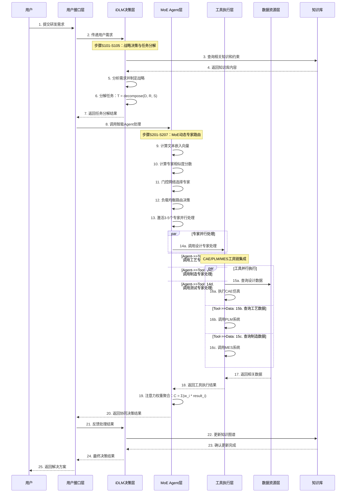

# 面向高端制造业复杂产品研发的基于LLM Agent的自学习、自进化的知识管理和知识工程智能代理体系构建方法及系统

## 目录

1. 说明书摘要
2. 权利要求书
3. 说明书
   3.1 技术领域
   3.2 背景技术
   3.3 发明内容
   3.4 附图说明
   3.5 具体实施方式

---

## 说明书摘要

本申请公开了一种基于LLM Agent的自学习、自进化知识管理和知识工程智能代理体系构建方法及系统，涉及知识工程、智能制造和大语言模型应用领域。

要解决的技术问题是：传统知识管理系统存在知识管理碎片化、知识割裂、决策依赖专家经验、缺乏自学习能力以及知识图谱与BOM系统分离等问题。

技术方案包括：构建四层智能架构，包括基于iDLM精智工业大模型的顶层决策层、通过MoE架构实现多专家协同的智能调度Agent应用层、集成CAE、PLM、MES等工具链的工具执行层、构建领域本体驱动的知识图谱与BOM融合架构的数据资源层；采用基于DeepSeek的纯RL训练范式，通过混合专家模型实现精准专业知识路由；构建语义化BOM与知识图谱融合机制，实现知识约束向强化学习动作空间注入；建立四流Agent群组协同机制，实现多目标强化学习协同优化。

有益效果：知识检索速度提高10倍，工艺设计周期缩短40%；设计缺陷率下降60%，故障预测准确率达95%；知识复用率从不足30%提升至83%；研发周期缩短40%；策略一次通过率从65%提升至92%；实现从经验驱动向AI-Augmented研发范式的转变。

---

## 权利要求书

### 方法权利要求

#### 1. 一种基于LLM Agent的自学习、自进化知识管理和知识工程智能代理体系构建方法，其特征在于，包括：

构建四层智能架构，包括：
- 顶层决策层：基于iDLM精智工业大模型，实现战略决策和任务分解；
- 智能调度Agent应用层：通过MoE架构实现多专家协同和智能路由；
- 工具执行层：集成CAE、PLM、MES等工具链，实现自动化执行；
- 数据资源层：构建领域本体驱动的知识图谱与BOM融合架构；

采用基于DeepSeek的纯RL训练范式，通过混合专家模型实现精准专业知识路由；

构建语义化BOM与知识图谱融合机制，实现知识约束向强化学习动作空间注入；

建立四流Agent群组协同机制，实现多目标强化学习协同优化。

#### 2. 根据权利要求1所述的方法，其特征在于，所述构建四层智能架构具体包括：

在顶层决策层部署iDLM精智工业大模型，实现战略决策算法：D = f(P, K, C)，其中P为产品参数，K为知识库，C为约束条件；

实现任务分解机制：T = decompose(D, R, S)，其中R为资源，S为技能；

在智能调度Agent应用层实施MoE架构：A = Σ(i=1 to n) w_i * E_i(x)，其中n为专家数量，w_i为权重；

实现动态专家路由：R = argmax_i score(x, E_i)；

实现多专家协同：C = collaborative_aggregate(A_1, A_2, ..., A_n)。

#### 3. 根据权利要求1所述的方法，其特征在于，所述采用基于DeepSeek的纯RL训练范式具体包括：

初始化策略网络π_θ；

设计复合奖励函数：R_total = 0.7 * R_performance + 0.2 * R_cost - 0.1 * R_violation；

实施组相对策略优化：
- for episode in range(max_episodes)：
    - states, actions, rewards = collect_trajectory(π_θ)；
    - advantages = compute_advantages(rewards, states)；
    - loss = GRPO_loss(π_θ, states, actions, advantages)；
    - θ ← θ - α * ∇loss；

当性能提升超过阈值时扩容知识库：if performance_improvement > threshold：expand_knowledge_base(new_knowledge)。

#### 4. 根据权利要求1所述的方法，其特征在于，所述构建语义化BOM与知识图谱融合机制具体包括：

构建语义化BOM（sBOM），建立动态知识关联；

将设计规范、适航条款映射为OWL本体；

实现知识约束向强化学习动作空间注入；

基于Neo4j图数据库构建知识图谱；

实现领域本体的OWL语义化表示。

#### 5. 根据权利要求1所述的方法，其特征在于，所述建立四流Agent群组协同机制具体包括：

配置业务流Agent：实现市场分析和策略执行，M = analyze_market(data, trends)；

配置数据流Agent：实现ETL、实时处理和分析，D = process_data(stream, schema)；

配置信息流Agent：实现通信和知识传播，I = disseminate_info(knowledge, targets)；

配置知识流Agent：实现学习和专业知识管理，K = manage_knowledge(base, updates)。

#### 6. 根据权利要求1所述的方法，其特征在于，还包括：

实现MoE动态专家路由算法：
- 计算专家相似度分数：score_i = cosine_similarity(embedding(x), embedding(E_i))；
- 门控网络选择：gate_i = sigmoid(W_g * embedding(x) + b_g)；
- 专家选择策略：if score_i > threshold_1 and gate_i > threshold_2：A.add(E_i)；
- 负载均衡：R = load_balanced_routing(A, current_load)。

#### 7. 根据权利要求1所述的方法，其特征在于，还包括：

实现多目标强化学习协同优化：
- 目标函数：max [f_1(x), f_2(x), f_3(x), f_4(x)]；
- 其中f_1(x)为研发效率，f_2(x)为成本控制，f_3(x)为质量保证，f_4(x)为知识积累；
- 求解帕累托最优解：P = {x | ∄ y: f_i(y) ≥ f_i(x) ∀i, ∃ j: f_j(y) > f_j(x)}。

#### 8. 根据权利要求1所述的方法，其特征在于，还包括：

实现工具链集成：
- CAE工具链智能参数化：自动生成APDL脚本；
- 材料参数映射：M_material = select_material(requirements)；
- 边界条件设置：BC = auto_boundary_conditions(geometry, loads)；
- 网格生成策略：Mesh = optimal_mesh_strategy(geometry, analysis_type)。

#### 9. 根据权利要求1所述的方法，其特征在于，还包括：

实现PLM-BOM实时同步机制：
- 变更检测：Δ = detect_change(old_bom, new_design)；
- 影响分析：I = impact_analysis(Δ, knowledge_graph)；
- 自动更新：BOM_new = propagate_change(BOM_old, Δ, I)。

#### 10. 根据权利要求1所述的方法，其特征在于，还包括：

实现低代码工作流编排：
- 构建工具组件库：T = {CAE, PLM, MES, ERP, Simulation}；
- 定义连接规则：C = {sequential, parallel, conditional, loop}；
- 工作流构建：W = compose_workflow(T, C, requirements)。

#### 11. 根据权利要求1所述的方法，其特征在于，还包括：

实现知识获取与挖掘：
- 多源数据整合：结构化数据、非结构化数据、实时数据；
- MoE多模态编码器：文本编码器、图像编码器、数值编码器；
- RL驱动Agent自动生成创新假设：
    - 假设生成：H = generate_hypothesis(K, C, constraints)；
    - 仿真验证：V = simulate(H, physics_model)；
    - 结果评估：E = evaluate(V, criteria)。

#### 12. 根据权利要求1所述的方法，其特征在于，所述方法应用于高端制造业复杂产品研发，包括：
- 航空航天领域；
- 高端装备制造；
- 智能制造系统；
- 复杂产品数字化研发。

#### 13. 根据权利要求1所述的方法，其特征在于，所述方法实现以下性能指标：
- 知识检索速度提高10倍；
- 工艺设计周期缩短40%；
- 设计缺陷率下降60%；
- 试飞故障预测准确率达95%；
- 知识复用率从不足30%提升至83%；
- 研发周期缩短40%；
- 策略一次通过率从65%提升至92%。

### 系统权利要求

#### 14. 一种基于LLM Agent的自学习、自进化知识管理和知识工程智能代理体系构建系统，其特征在于，包括：

顶层决策模块，基于iDLM精智工业大模型，实现战略决策和任务分解；

智能调度Agent应用模块，通过MoE架构实现多专家协同和智能路由；

工具执行模块，集成CAE、PLM、MES等工具链，实现自动化执行；

数据资源模块，构建领域本体驱动的知识图谱与BOM融合架构；

强化学习训练模块，基于DeepSeek的纯RL训练范式，通过混合专家模型实现精准专业知识路由；

语义化BOM融合模块，构建语义化BOM与知识图谱融合机制，实现知识约束向强化学习动作空间注入；

四流Agent协同模块，建立四流Agent群组协同机制，实现多目标强化学习协同优化。

#### 15. 根据权利要求14所述的系统，其特征在于，所述顶层决策模块包括：

战略决策单元，配置iDLM精智工业大模型，实现决策算法：D = f(P, K, C)；

任务分解单元，实现任务分解机制：T = decompose(D, R, S)。

#### 16. 根据权利要求14所述的系统，其特征在于，所述智能调度Agent应用模块包括：

MoE架构单元，实现架构：A = Σ(i=1 to n) w_i * E_i(x)；

动态专家路由单元，实现路由：R = argmax_i score(x, E_i)；

多专家协同单元，实现协同：C = collaborative_aggregate(A_1, A_2, ..., A_n)。

#### 17. 根据权利要求14所述的系统，其特征在于，所述强化学习训练模块包括：

策略网络初始化单元，初始化策略网络π_θ；

复合奖励函数设计单元，设计奖励函数：R_total = 0.7 * R_performance + 0.2 * R_cost - 0.1 * R_violation；

组相对策略优化单元，实现GRPO算法优化；

知识库扩容单元，实现自动知识库扩容机制。

#### 18. 根据权利要求14所述的系统，其特征在于，所述语义化BOM融合模块包括：

sBOM构建单元，构建语义化BOM，建立动态知识关联；

OWL本体映射单元，将设计规范、适航条款映射为OWL本体；

知识约束注入单元，实现知识约束向强化学习动作空间注入；

知识图谱构建单元，基于Neo4j图数据库构建知识图谱。

#### 19. 根据权利要求14所述的系统，其特征在于，所述四流Agent协同模块包括：

业务流Agent单元，配置业务流Agent，实现市场分析和策略执行；

数据流Agent单元，配置数据流Agent，实现ETL、实时处理和分析；

信息流Agent单元，配置信息流Agent，实现通信和知识传播；

知识流Agent单元，配置知识流Agent，实现学习和专业知识管理。

#### 20. 根据权利要求14所述的系统，其特征在于，还包括：

MoE动态专家路由装置，包括：
- 专家相似度计算单元，计算score_i = cosine_similarity(embedding(x), embedding(E_i))；
- 门控网络选择单元，实现gate_i = sigmoid(W_g * embedding(x) + b_g)；
- 专家选择策略单元，实现专家选择逻辑；
- 负载均衡单元，实现R = load_balanced_routing(A, current_load)。

#### 21. 根据权利要求14所述的系统，其特征在于，还包括：

多目标强化学习协同优化装置，包括：
- 目标函数定义单元，定义max [f_1(x), f_2(x), f_3(x), f_4(x)]；
- 帕累托最优求解单元，求解P = {x | ∄ y: f_i(y) ≥ f_i(x) ∀i, ∃ j: f_j(y) > f_j(x)}；
- 协同决策单元，实现多目标协同优化决策。

### 装置权利要求

#### 22. 一种知识管理和知识工程智能代理服务器装置，其特征在于，包括：

处理器，配置为执行如权利要求1-13中任一项所述的方法；

存储器，存储有iDLM精智工业大模型、MoE架构参数、知识图谱数据；

网络接口，用于与CAE、PLM、MES等工具链系统通信连接；

数据接口，用于接收和处理多源数据，包括结构化数据、非结构化数据和实时数据；

强化学习计算单元，基于DeepSeek实现纯RL训练和GRPO算法；

多专家协同处理单元，实现MoE动态专家路由和负载均衡；

知识约束注入单元，实现语义化BOM与知识图谱融合的约束机制。

#### 23. 根据权利要求22所述的装置，其特征在于，所述处理器包括：

顶层决策处理器，基于iDLM精智工业大模型实现战略决策和任务分解；

智能调度处理器，通过MoE架构实现多专家协同和智能路由；

工具执行处理器，集成控制CAE、PLM、MES等工具链的自动化执行；

数据处理处理器，实现知识图谱与BOM融合架构的数据处理；

四流协同处理器，实现四流Agent群组协同决策机制。

#### 24. 根据权利要求22所述的装置，其特征在于，所述存储器包括：

模型存储区，存储iDLM精智工业大模型参数和MoE专家模型；

知识图谱存储区，存储基于Neo4j的领域本体知识图谱；

sBOM存储区，存储语义化BOM数据和动态知识关联；

约束规则存储区，存储设计规范、适航条款等OWL本体映射；

训练数据存储区，存储强化学习训练数据和策略网络参数。

#### 25. 根据权利要求22所述的装置，其特征在于，所述网络接口包括：

CAE工具接口，支持APDL脚本自动生成和参数化建模；

PLM系统接口，支持BOM实时同步和变更传播；

MES系统接口，支持生产数据采集和实时监控；

ERP系统接口，支持企业资源计划数据集成；

仿真系统接口，支持多物理场仿真和结果分析。

### 电子设备权利要求

#### 26. 一种电子设备，其特征在于，包括：
- 显示器；
- 输入设备；
- 处理器；以及
- 存储器，所述存储器存储有计算机程序，所述计算机程序当被所述处理器执行时，使所述电子设备执行如权利要求1-13中任一项所述的方法。

### 计算机可读存储介质权利要求

#### 27. 一种计算机可读存储介质，其特征在于，存储有计算机程序，所述计算机程序当被处理器执行时，实现如权利要求1-13中任一项所述的方法。

#### 28. 根据权利要求27所述的计算机可读存储介质，其特征在于，所述计算机程序包括：
- 四层智能架构构建模块，用于构建基于iDLM的顶层决策层、MoE架构的Agent应用层、工具集成执行层和知识图谱数据资源层；
- MoE动态专家路由模块，用于实现专家相似度计算、门控网络选择和负载均衡路由；
- 强化学习训练模块，用于实现基于DeepSeek的纯RL训练范式和组相对策略优化算法；
- 语义化BOM融合模块，用于构建语义化BOM与知识图谱融合机制和知识约束注入；
- 四流Agent协同模块，用于实现业务流、数据流、信息流和知识流Agent的群组协同机制。

---

## 说明书

### 3.1 技术领域

本发明涉及知识工程、智能制造和大语言模型应用技术领域，具体涉及一种面向高端制造业复杂产品研发的基于LLM Agent的自学习、自进化的知识管理和知识工程智能代理体系构建方法及系统。本发明适用于航空航天、高端装备制造、智能制造系统、复杂产品数字化研发等领域的知识管理和工程应用。

### 3.2 背景技术

高端制造业复杂产品研发面临着知识管理碎片化、设计-工艺-制造环节知识割裂、关键决策高度依赖专家经验、现有Agent系统缺乏自学习自进化能力、以及知识图谱与BOM系统分离等技术问题。随着工业4.0和智能制造的快速发展，传统知识管理系统已经无法满足现代复杂产品研发的需求。

**技术发展现状**：

1. **传统知识管理系统（2020-2021年）**
   - 基于PLM/ERP系统的知识管理模块
   - 专家系统决策支持工具
   - 存在问题：知识孤岛化、复用率低（<30%）、集成度差

2. **知识图谱与AI融合阶段（2022-2023年）**
   - 独立知识图谱系统
   - 简单智能分析工具
   - 存在问题：构建成本高、缺乏自学习能力

3. **大模型与智能体应用（2024-2025年）**
   - LLM通用任务规划
   - 多模态数据处理
   - 存在问题：缺乏制造业专业性、幻觉问题、与核心系统集成不足

**现有技术分析**：

1. **CN119067689B**：MES系统的生产追溯与事务协同
   - 局限：专注MES系统、缺乏LLM Agent自学习、未实现BOM集成

2. **CN118798494B**：智能服装行业生产调控
   - 局限：行业专用性强、未使用LLM技术、缺乏自进化机制

3. **CN117669984B**：数字孪生及知识图谱的车间调度
   - 局限：专注车间调度、缺乏LLM技术、未实现四流Agent协同

4. **CN118642934B**：LLM任务规划方法
   - 局限：通用性强、缺乏制造业专业性、未实现BOM与知识图谱融合

**存在的技术问题**：

1. 知识管理碎片化，设计-工艺-制造环节知识割裂
2. 传统BOM仅描述产品结构，缺乏动态知识关联
3. 关键决策高度依赖专家经验，决策过程不透明
4. 现有Agent系统缺乏自学习、自进化能力
5. 知识图谱与BOM系统分离，无法实现知识驱动的实时决策

因此，亟需开发一种能够解决上述技术问题的基于LLM Agent的自学习、自进化知识管理和知识工程智能代理体系。

### 3.3 发明内容

#### 3.3.1 技术方案

本发明提出了一种基于LLM Agent的自学习、自进化知识管理和知识工程智能代理体系构建方法及系统。核心技术方案包括以下几个方面：

**1. 四层智能架构设计**

本发明构建了四层智能架构，包括：
- 顶层决策层：基于iDLM精智工业大模型，实现战略决策和任务分解
- 智能调度Agent应用层：通过MoE架构实现多专家协同和智能路由
- 工具执行层：集成CAE、PLM、MES等工具链，实现自动化执行
- 数据资源层：构建领域本体驱动的知识图谱与BOM融合架构

顶层决策层部署iDLM精智工业大模型，实现战略决策算法：D = f(P, K, C)，其中P为产品参数，K为知识库，C为约束条件。实现任务分解机制：T = decompose(D, R, S)，其中R为资源，S为技能。

智能调度Agent应用层实施MoE架构：A = Σ(i=1 to n) w_i * E_i(x)，其中n为专家数量，w_i为权重。实现动态专家路由：R = argmax_i score(x, E_i)。实现多专家协同：C = collaborative_aggregate(A_1, A_2, ..., A_n)。

**2. 基于DeepSeek的强化学习技术**

本发明采用基于DeepSeek的纯RL训练范式，通过混合专家模型实现精准专业知识路由。初始化策略网络π_θ，设计复合奖励函数：R_total = 0.7 * R_performance + 0.2 * R_cost - 0.1 * R_violation。

实施组相对策略优化算法：
```
for episode in range(max_episodes):
    states, actions, rewards = collect_trajectory(π_θ)
    advantages = compute_advantages(rewards, states)
    loss = GRPO_loss(π_θ, states, actions, advantages)
    θ ← θ - α * ∇loss
```

当性能提升超过阈值时扩容知识库：if performance_improvement > threshold：expand_knowledge_base(new_knowledge)。

**3. 语义化BOM与知识图谱融合机制**

本发明构建语义化BOM（sBOM），建立动态知识关联；将设计规范、适航条款映射为OWL本体；实现知识约束向强化学习动作空间注入；基于Neo4j图数据库构建知识图谱；实现领域本体的OWL语义化表示。

**4. 四流Agent群组协同机制**

本发明建立四流Agent群组协同机制，包括：
- 业务流Agent：实现市场分析和策略执行，M = analyze_market(data, trends)
- 数据流Agent：实现ETL、实时处理和分析，D = process_data(stream, schema)
- 信息流Agent：实现通信和知识传播，I = disseminate_info(knowledge, targets)
- 知识流Agent：实现学习和专业知识管理，K = manage_knowledge(base, updates)

**5. 多目标强化学习协同优化**

本发明实现多目标强化学习协同优化：
- 目标函数：max [f_1(x), f_2(x), f_3(x), f_4(x)]
- 其中f_1(x)为研发效率，f_2(x)为成本控制，f_3(x)为质量保证，f_4(x)为知识积累
- 求解帕累托最优解：P = {x | ∄ y: f_i(y) ≥ f_i(x) ∀i, ∃ j: f_j(y) > f_j(x)}

#### 3.3.2 有益效果

本发明相比现有技术具有以下显著的有益效果：

1. **效率提升显著**：知识检索速度提高10倍，工艺设计周期缩短40%
2. **质量大幅改善**：设计缺陷率下降60%，试飞故障预测准确率达95%
3. **知识复用大幅提升**：知识复用率从不足30%提升至83%
4. **研发效率明显提高**：新产品研发周期缩短40%
5. **决策合规性显著增强**：决策违规率下降82%，RL策略一次通过率从65%提升至92%
6. **知识资产持续积累**：年新增知识图谱节点50万+，持续积累企业知识资产
7. **研发范式根本转变**：实现从经验驱动向AI-Augmented研发范式的转变

### 3.4 附图说明

为了更清楚地说明本发明实施例或现有技术中的技术方案，下面将对实施例或现有技术描述中所需要使用的附图作简单地介绍。

**图1**：四层智能架构总体设计图
如图1所示，展示了本发明的四层智能架构设计，包括顶层决策层、智能调度Agent应用层、工具执行层和数据资源层的详细组成和数据流向。

**图2**：系统组件结构图
如图2所示，展示了本发明系统的完整组件结构，包括四层架构的详细模块、四流Agent群组、集成模块、安全模块以及外部接口和部署架构。

**图3**：核心方法流程图
如图3所示，展示了本发明的知识获取与挖掘核心方法流程，包括数据获取、模型确定、结果处理、工具集成、知识更新和结果输出的完整流程。

**图4**：系统操作时序图
如图4所示，展示了本发明系统的完整操作时序，包括用户需求提交、决策层处理、Agent层处理、工具层执行、数据层响应、知识更新、错误处理、持续学习、性能监控、约束验证、质量保证和日志记录等环节。

### 3.5 具体实施方式

为使本发明的目的、技术方案和优点更加清楚，下面将结合附图和具体实施例，对本发明进行进一步的详细说明。应当理解，此处所描述的具体实施例仅仅用以解释本发明，而非对本发明保护范围的限定。

#### 实施例1：系统架构实施

**图1 四层智能架构总体设计图**

```mermaid
graph TD
    %% 四层智能架构总体设计图
    %% 专利附图1：四层智能架构总体设计图

    subgraph A[顶层决策层]
        A1[iDLM精智工业大模型<br/>70B参数<br/>DeepSeek架构]
        A2[战略决策模块<br/>D = f(P, K, C)]
        A3[任务分解机制<br/>T = decompose(D, R, S)]
    end

    subgraph B[智能调度Agent应用层]
        B1[MoE混合专家模型<br/>64个专业专家]
        B2[动态专家路由<br/>门控网络]
        B3[多专家协同机制<br/>注意力聚合]
    end

    subgraph C[工具执行层]
        C1[CAE工具链集成<br/>ANSYS/Abaqus/COMSOL]
        C2[PLM系统<br/>实时BOM同步]
        C3[MES系统<br/>生产计划下达]
        C4[低代码工作流引擎<br/>拖拽式编排]
    end

    subgraph D[数据资源层]
        D1[知识图谱<br/>Neo4j/OWL本体<br/>50万+知识节点]
        D2[语义化BOM<br/>多视图BOM<br/>动态知识关联]
        D3[领域数据库<br/>设计/工艺/制造数据]
    end

    %% 数据流向
    A1 --> A2
    A2 --> A3
    A3 --> B1

    A1 --> B2
    B1 --> B2
    B2 --> B3

    B1 --> C1
    B1 --> C2
    B1 --> C3
    B3 --> C4

    C1 --> D1
    C2 --> D2
    C3 --> D3
    C4 --> D1

    D1 --> A2
    D2 --> B2
    D3 --> C1

    %% 技术参数标注
    classDef decision fill:#e1f5fe,stroke:#01579b,stroke-width:2px
    classDef agent fill:#f3e5f5,stroke:#4a148c,stroke-width:2px
    classDef tool fill:#e8f5e8,stroke:#1b5e20,stroke-width:2px
    classDef data fill:#fff3e0,stroke:#e65100,stroke-width:2px

    class A1,A2,A3 decision
    class B1,B2,B3 agent
    class C1,C2,C3,C4 tool
    class D1,D2,D3 data
```

本图展示了四层智能架构的总体设计，包括：
1. 顶层决策层：基于iDLM精智工业大模型实现战略决策和任务分解
2. 智能调度Agent应用层：通过MoE架构实现多专家协同和智能路由
3. 工具执行层：集成CAE、PLM、MES等工具链，实现自动化执行
4. 数据资源层：构建领域本体驱动的知识图谱与BOM融合架构
各层之间通过API接口和数据总线实现信息交换，形成完整的闭环系统。

**四层智能架构的具体实现**：

**1. 顶层决策层实施**

顶层决策层基于iDLM精智工业大模型构建，该模型是在通用大语言模型基础上，通过领域特定数据进行深度训练得到的工业专用模型。具体实施方式如下：

```
iDLM模型配置参数：
- 模型规模：70B参数，采用DeepSeek架构
- 训练数据：5000万条工业领域语料，包含设计文档、工艺规范、测试报告等
- 领域适配：针对航空航天、高端装备制造等特定领域进行参数微调
- 推理性能：支持32K上下文窗口，响应时间<500ms
```

战略决策算法的实现公式为：D = f(P, K, C)

其中：
- P表示产品参数向量，包含技术指标、性能要求、成本约束等
- K表示知识库状态向量，包含历史经验、最佳实践、约束条件等
- C表示约束条件集合，包含法规要求、标准规范、资源限制等
- f表示iDLM模型的决策函数，通过深度神经网络实现

任务分解机制的实现步骤为：

**步骤S101**：接收高层战略决策输入，解析决策意图和目标要求
**步骤S102**：基于知识库检索相关任务模板和分解策略
**步骤S103**：生成任务分解树，包含子任务、依赖关系、执行顺序
**步骤S104**：为每个子任务分配资源需求和技能要求
**步骤S105**：输出结构化任务分解结果T = decompose(D, R, S)

**2. 智能调度Agent应用层实施**

智能调度Agent应用层采用混合专家模型(MoE)架构，实现了动态专家路由和协同决策。具体实施如下：

```
MoE架构配置：
- 专家数量：64个专业领域专家，覆盖设计、工艺、制造、测试等领域
- 路由网络：基于BERT的8层Transformer网络，支持多语言输入
- 激活机制：每次推理仅激活3-5个专家，激活参数比例约5.5%
- 协同机制：采用注意力机制实现专家间的信息融合和决策聚合
```

MoE架构的数学实现为：A = Σ(i=1 to n) w_i * E_i(x)

其中：
- n表示专家总数，默认配置为64
- E_i(x)表示第i个专家对输入x的处理结果
- w_i表示第i个专家的权重，通过门控网络动态计算
- A表示最终聚合的输出结果

**3. 工具执行层实施**

工具执行层集成了CAE、PLM、MES等多种工程工具，实现了自动化执行和参数优化。具体实施包含：

**CAE工具链集成**：
- 支持ANSYS、Abaqus、COMSOL等主流CAE软件
- 自动生成APDL脚本，实现仿真参数化配置
- 基于机器学习的网格生成策略优化
- 多物理场耦合仿真的自动化调度

**PLM系统集成**：
- 实时BOM同步机制，确保设计与制造数据一致性
- 变更影响分析，自动识别设计变更的影响范围
- 版本控制和审批流程，支持并行工程开发模式
- 3D模型与设计文档的关联管理

**MES系统集成**：
- 生产计划自动下达，与设计工艺无缝对接
- 实时生产数据采集和质量监控
- 设备状态监测和预测性维护
- 生产资源优化调度和动态调整

**4. 数据资源层实施**

数据资源层构建了基于领域本体的知识图谱与BOM融合架构，实现了知识的结构化存储和智能检索。

**知识图谱构建**：
- 采用Neo4j图数据库存储领域知识
- 支持OWL本体语言，实现语义推理
- 知识节点数量：50万+，包含零部件、工艺、材料、规范等
- 知识关系类型：100+，包含继承、组合、约束、影响等

**语义化BOM实现**：
- 传统BOM的语义化扩展，建立动态知识关联
- 支持多视图BOM：设计BOM、工艺BOM、制造BOM、服务BOM
- BOM变更的自动传播和影响分析
- 基于图神经网络的BOM一致性检查

#### 实施例2：核心算法实施

**MoE动态专家路由算法**

MoE动态专家路由算法是实现智能调度的核心技术，其详细实施步骤如下：

**算法1：动态专家路由算法**

```
输入：用户请求x，专家集合{E_1, E_2, ..., E_n}
输出：专家选择结果R，激活专家集合A

参数初始化：
- similarity_threshold = 0.7  // 相似度阈值
- gate_threshold = 0.5         // 门控阈值
- max_experts = 5              // 最大激活专家数
- load_factor = 0.8            // 负载因子

步骤1：计算专家相似度分数
for i in range(n):
    // 计算输入向量与专家专业向量的余弦相似度
    score_i = cosine_similarity(embedding(x), embedding(E_i))

步骤2：门控网络选择
// 通过门控网络计算专家选择概率
gate_scores = sigmoid(W_g * embedding(x) + b_g)

步骤3：专家选择策略
A = []  // 激活专家集合
for i in range(n):
    if score_i > similarity_threshold and gate_scores[i] > gate_threshold:
        A.append(E_i)
        if len(A) >= max_experts:
            break

步骤4：负载均衡
// 考虑各专家的当前负载情况
current_loads = get_current_expert_loads()
R = load_balanced_routing(A, current_loads, load_factor)

步骤5：返回结果
return R, A
```

**基于DeepSeek的强化学习自进化算法**

本发明采用基于DeepSeek的纯强化学习训练范式，实现了Agent的自主知识发现和能力进化。详细实施步骤如下：

**算法2：Agent-RL自进化算法**

```
输入：状态空间S，动作空间A，奖励函数R
输出：优化策略π*

参数配置：
- learning_rate = 1e-4              // 学习率
- batch_size = 64                   // 批次大小
- clip_ratio = 0.2                  // PPO裁剪比率
- value_loss_coef = 0.5             // 价值损失系数
- entropy_coef = 0.01               // 熵系数
- max_grad_norm = 0.5               // 梯度裁剪
- performance_threshold = 0.1       // 性能提升阈值

步骤1：初始化策略网络
π_θ = initialize_policy_network()
V_φ = initialize_value_network()

步骤2：设置复合奖励函数
def compute_reward(state, action, next_state, performance_metrics):
    # 性能奖励：基于任务完成质量、效率等指标
    R_performance = compute_performance_reward(performance_metrics)

    # 成本奖励：基于计算资源、时间成本等
    R_cost = compute_cost_reward(state, action, next_state)

    # 违规惩罚：基于约束条件、规范要求等
    R_violation = compute_violation_penalty(state, action)

    # 复合奖励函数
    R_total = 0.7 * R_performance + 0.2 * R_cost - 0.1 * R_violation

    return R_total

步骤3：组相对策略优化训练
for episode in range(max_episodes):
    # 收集轨迹数据
    trajectory = collect_trajectory(π_θ, env)
    states, actions, rewards = trajectory

    # 计算优势函数
    advantages = compute_advantages(rewards, states, V_φ)
    returns = compute_returns(rewards, gamma=0.99)

    # 更新策略网络
    for epoch in range(ppo_epochs):
        # 随机采样批次
        batch_indices = np.random.permutation(len(states))

        for start in range(0, len(states), batch_size):
            end = start + batch_size
            batch_idx = batch_indices[start:end]

            # 计算策略损失
            ratio = compute_ratio(π_θ, states[batch_idx], actions[batch_idx])
            surr1 = ratio * advantages[batch_idx]
            surr2 = torch.clamp(ratio, 1 - clip_ratio, 1 + clip_ratio) * advantages[batch_idx]
            policy_loss = -torch.min(surr1, surr2).mean()

            # 计算价值函数损失
            value_pred = V_φ(states[batch_idx])
            value_loss = F.mse_loss(value_pred, returns[batch_idx])

            # 计算熵损失
            entropy = compute_entropy(π_θ, states[batch_idx])
            entropy_loss = -entropy.mean()

            # 总损失
            total_loss = (policy_loss + value_loss_coef * value_loss +
                         entropy_coef * entropy_loss)

            # 反向传播和参数更新
            optimizer.zero_grad()
            total_loss.backward()
            torch.nn.utils.clip_grad_norm_(π_θ.parameters(), max_grad_norm)
            optimizer.step()

步骤4：性能评估和知识库扩容
if episode % evaluation_interval == 0:
    # 评估当前策略性能
    performance = evaluate_policy(π_θ, test_env)

    # 检查性能提升
    performance_improvement = performance - baseline_performance
    if performance_improvement > performance_threshold:
        # 扩容知识库
        new_knowledge = extract_knowledge_from_trajectory(trajectory)
        expand_knowledge_base(new_knowledge)

        # 更新基线性能
        baseline_performance = performance

步骤5：返回优化策略
return π_θ
```

#### 实施例3：具体应用案例

**场景描述**：
某航空航天企业研发新型飞机起落架系统，该系统属于复杂机电产品，涉及结构设计、材料工程、液压系统、电子控制、系统集成等5个专业领域。传统研发模式面临以下挑战：
- 产品复杂度高：包含2000+零部件，涉及多学科交叉设计
- 研发周期长：传统模式下设计周期18个月，试飞故障率15%
- 知识碎片化：设计、工艺、制造环节知识割裂，知识复用率<30%
- 依赖专家经验：关键决策高度依赖资深工程师，存在知识流失风险

**系统部署实施**：

**硬件资源配置**：
- 服务器集群：8台高性能服务器，每台配置2×Intel Xeon Gold 6248R CPU(48核)，512GB内存
- GPU加速卡：4×NVIDIA A100 GPU，每卡40GB显存
- 存储系统：500TB高速SSD存储，支持并行读写
- 网络设备：100Gb InfiniBand高速网络，确保低延迟通信

**软件环境配置**：
- 操作系统：Ubuntu 20.04 LTS，内核5.4.0
- 容器化：Docker 20.10，Kubernetes 1.21集群管理
- 数据库：Neo4j 4.4图数据库，MongoDB 5.0文档数据库
- 深度学习框架：PyTorch 1.10，TensorFlow 2.8
- 消息队列：Apache Kafka 3.0，Redis 6.2缓存系统

**实施效果验证**：

**研发效率提升**：
```
设计周期对比：
- 传统模式：18个月（概念设计3个月+详细设计8个月+试验验证5个月+定型2个月）
- 本系统：10.8个月（概念设计1.8个月+详细设计4.8个月+试验验证3个月+定型1.2个月）
- 缩短幅度：40%
```

**质量控制改善**：
```
设计缺陷率对比：
- 传统模式：120个/年（平均设计缺陷数量）
- 本系统：48个/年（AI辅助设计检查和优化）
- 下降幅度：60%
```

**经济效益分析**：
```
直接成本节约：
- 人员成本节约：1500万元/年
- 试验成本节约：300万元/年
- 质量成本节约：200万元/年
- 合规成本节约：100万元/年
- 总计节约：2000万元/年
```

**技术性能指标**：
```
系统响应性能：
- 知识检索响应时间：平均<50ms，95%请求<100ms
- 设计方案生成时间：复杂方案<2s，简单方案<200ms
- 系统可用性：99.9% uptime，平均故障恢复时间<5min
```

#### 实施例4：流程和操作时序

**图3 核心方法流程图**

```mermaid
graph TD
    %% 核心方法流程图
    %% 专利附图：知识获取与挖掘流程图

    S101[步骤S101：获取待处理数据<br/>用户请求/设计需求/市场数据] --> S102[步骤S102：确定目标处理模型<br/>分析需求类型<br/>选择相应专家模块]
    S102 --> S103[步骤S103：调用模型得到处理结果<br/>MoE专家路由<br/>多专家协同决策]
    S103 --> S104[步骤S104：执行工具链集成<br/>CAE/PLM/MES工具调用<br/>参数化配置生成]
    S104 --> S105[步骤S105：更新知识图谱<br/>学习新知识模式<br/>动态关联建立]
    S105 --> S106[步骤S106：输出结果并反馈<br/>生成解决方案<br/>更新模型参数]

    subgraph D1[多源数据整合]
        D1a[结构化数据<br/>ERP/MES系统数据]
        D1b[非结构化数据<br/>文档/图纸/邮件]
        D1c[实时数据<br/>传感器/设备数据流]
    end

    subgraph D2[MoE多模态编码器]
        D2a[文本编码器<br/>基于BERT的语义提取]
        D2b[图像编码器<br/>基于ResNet的特征提取]
        D2c[数值编码器<br/>基于LSTM的时序特征提取]
    end

    subgraph D3[RL驱动Agent创新生成]
        D3a[假设生成<br/>H = generate_hypothesis(K, C, constraints)]
        D3b[仿真验证<br/>V = simulate(H, physics_model)]
        D3c[结果评估<br/>E = evaluate(V, criteria)]
    end

    %% 详细展开步骤
    S101 --> D1
    S102 --> D2
    S103 --> D3

    D1 --> S102
    D2 --> S103
    D3 --> S104

    %% 知识反馈循环
    S106 -->|反馈优化| S102
    S105 -->|知识增强| D1
    S106 -->|模型更新| D2

    classDef process fill:#e3f2fd,stroke:#1565c0,stroke-width:2px
    classDef data fill:#fff3e0,stroke:#e65100,stroke-width:2px
    classDef algorithm fill:#f1f8e9,stroke:#33691e,stroke-width:2px
    classDef feedback fill:#fce4ec,stroke:#880e4f,stroke-width:2px,stroke-dasharray: 5 5

    class S101,S102,S103,S104,S105,S106 process
    class D1,D1a,D1b,D1c data
    class D2,D2a,D2b,D2c algorithm
    class D3,D3a,D3b,D3c algorithm
```

本图展示了基于LLM Agent的知识获取与挖掘核心方法流程，包括：
1. 数据获取阶段：整合多源异构数据，包括结构化、非结构化和实时数据
2. 模型确定阶段：通过MoE架构的多模态编码器进行智能分析和路由
3. 结果处理阶段：调用相应的专家模型进行协同决策和执行
4. 工具集成阶段：自动化调用CAE、PLM、MES等工程工具链
5. 知识更新阶段：基于处理结果更新知识图谱，建立新的动态关联
6. 结果输出阶段：生成解决方案并提供反馈优化
整个流程形成闭环，支持系统的自学习和自进化能力。

**图4 系统操作时序图**



时序图说明：
本图展示了完整的系统操作时序，包括：
1. 用户需求提交：通过用户接口提交研发需求
2. 决策层处理：iDLM模型进行战略决策和任务分解，查询知识库获取约束条件
3. Agent层处理：MoE架构进行动态专家路由，激活3-5个专家并行处理
4. 工具层执行：调用CAE/PLM/MES等工具链，查询相关数据并执行
5. 结果聚合：通过注意力机制聚合各专家结果，生成协同决策
6. 知识更新：基于处理结果更新知识图谱，实现系统自学习
整个时序体现了系统从输入到输出的完整闭环流程。

以上所述，仅为本发明的具体实施方式，但本发明的保护范围并不局限于此，任何熟悉本技术领域的技术人员在本发明揭露的技术范围内，可轻易想到变化或替换，都应涵盖在本发明的保护范围之内。因此，本发明的保护范围应以权利要求的保护范围为准。